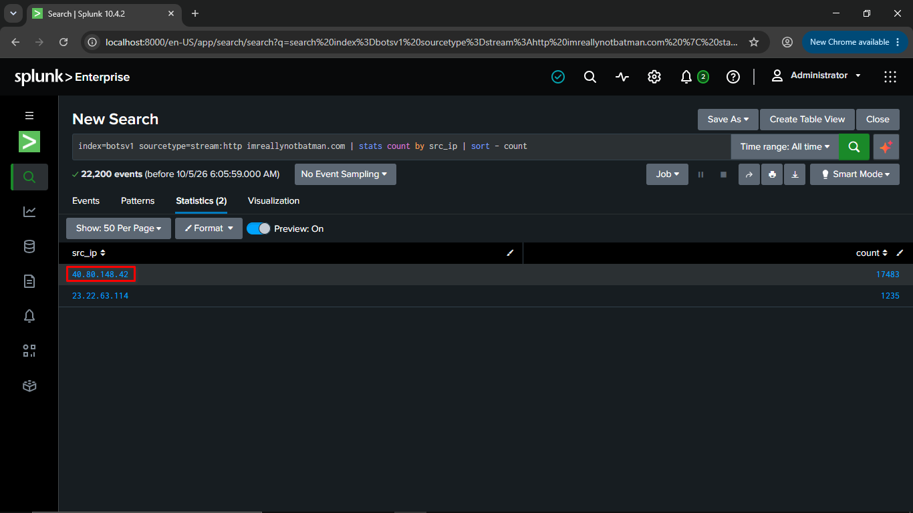
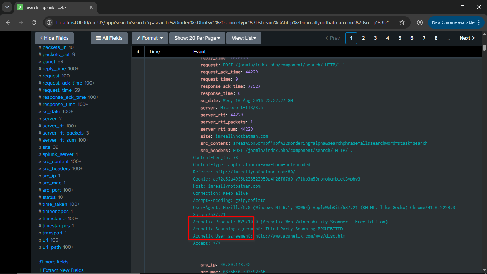
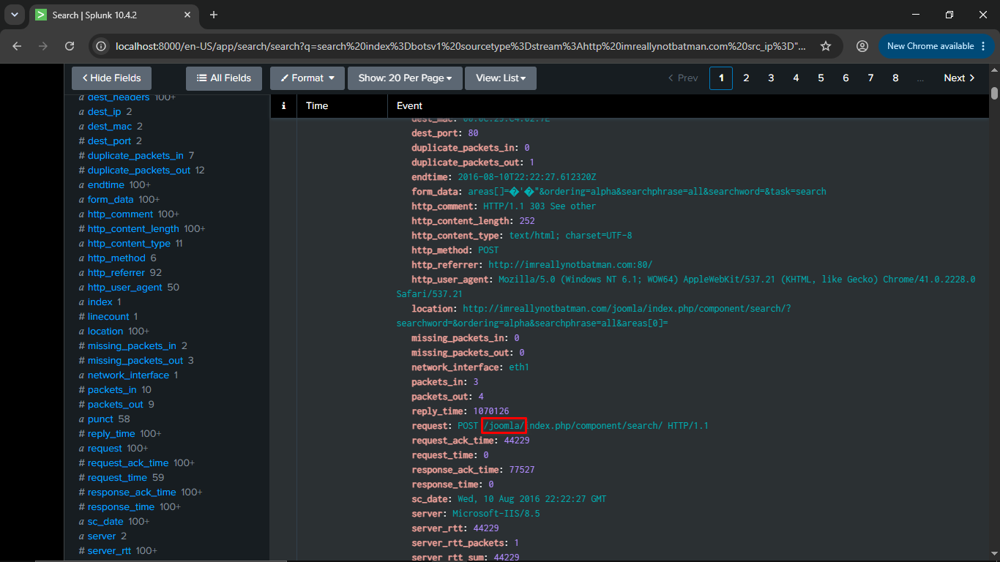
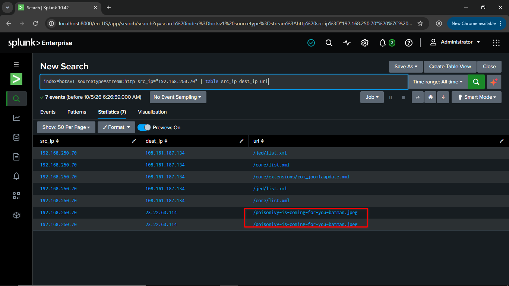
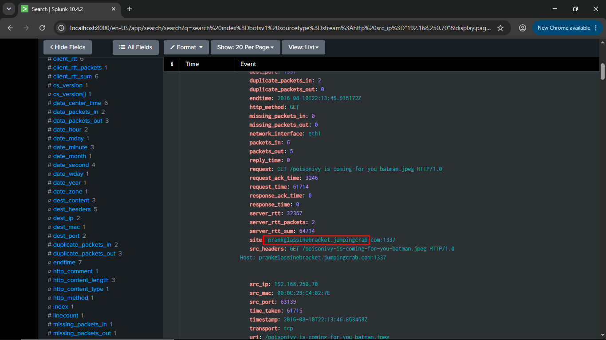
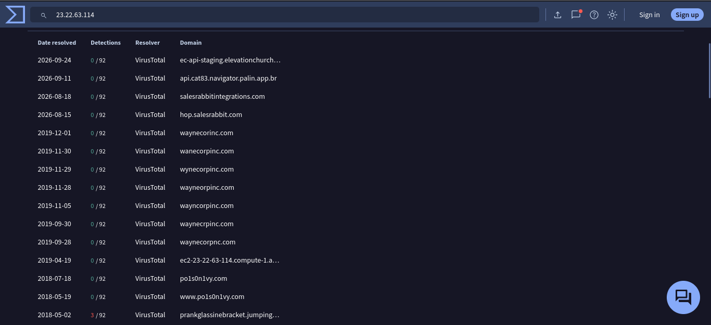
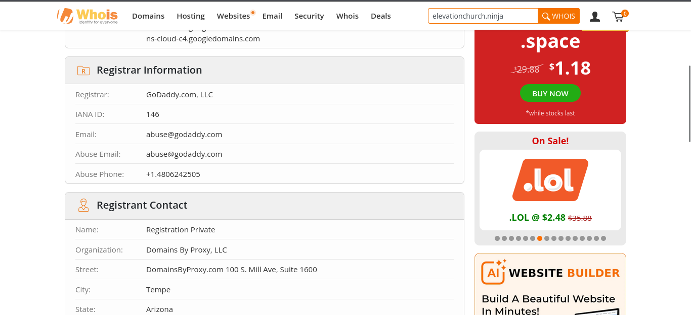
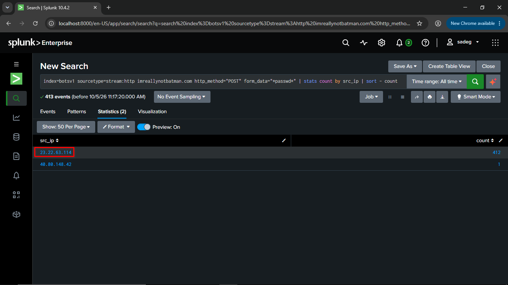
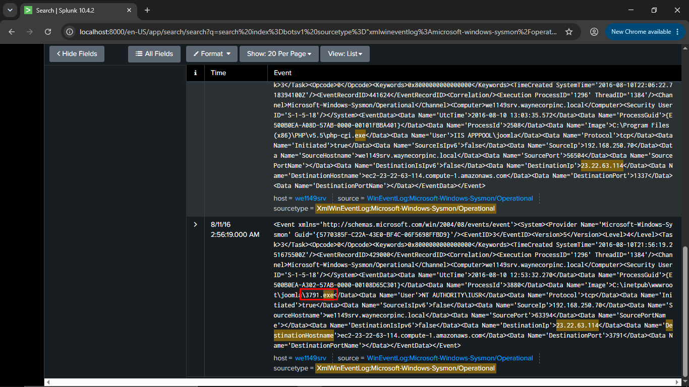
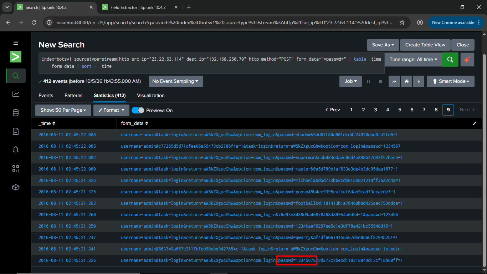

# BOTS v1 APT Walkthrough: Step-by-Step Investigation

This walkthrough follows the investigation in the order an analyst would work it: from first signs of scanning, through the brute force and compromise, to the OSINT pivots. Each step has the reasoning, the SPL, and a screenshot.


---

## Step 0: Orient Yourself in the Data

Before answering anything, see what exists. This avoids guessing field names later.

```spl
index=botsv1 earliest=0
| stats count by sourcetype
| sort - count
```

**Why:** Shows which sources are available (`stream:http`, `suricata`, `iis`, `fgt_utm`, Sysmon, and so on). Web attack questions point to `stream:http`; endpoint questions point to Sysmon.


---


### Q101: What is the likely IP address of someone from the Po1s0n1vy group scanning imreallynotbatman.com for web application vulnerabilities?

**Approach:** The target domain is named in the question, so search web traffic for it and count requests per source IP. A scanner generates far more requests than a normal visitor.

```spl
index=botsv1 sourcetype=stream:http imreallynotbatman.com
| stats count by src_ip
| sort - count
```

**Answer:** `40.80.148.42` is the top source by request volume.



### Q102: What company created the web vulnerability scanner used by Po1s0n1vy?

**Approach:** Narrow to the suspect IP and inspect the raw HTTP events (headers, request paths) for a tool signature.

```spl
index=botsv1 sourcetype=stream:http imreallynotbatman.com scanning src_ip="40.80.148.42"
```

**Answer:** The traffic identifies the scanner as **Acunetix**, so the company is Acunetix.



### Q103: What content management system is imreallynotbatman.com likely using??

**Approach:** Look at the URIs the scanner and visitors requested. CMS platforms have recognisable path structures.

```spl
index=botsv1 sourcetype=stream:http imreallynotbatman.com scanning src_ip="40.80.148.42"
```

**Finding:** **Joomla**.




**Phase takeaway:** One IP generating high-volume automated requests is the reconnaissance stage.

### Q104: What is the name of the file that defaced the imreallynotbatman.com website?

**Approach:** The server started to upload an image from an external network(`Attacker IP`) so search with this:

```spl
index=botsv1 sourcetype=stream:http src_ip="192.168.250.70" | table src_ip dest_ip uri
```
**Answer:** `poisonivy-is-coming-for-you-batman.jpeg`




### Q105: This attack used dynamic DNS to resolve to the malicious IP. What fully qualified domain name (FQDN) is associated with this attack?

**Approach:** The site field contain a FQDN that associated with the attacker

```spl
index=botsv1 sourcetype=stream:http src_ip="192.168.250.70" uri="poisonivy-is-coming-for-you-batman.jpeg
```
**Answer:** `prankglassinebracket.jumpingcrab.com`



### Q106: What IP address has Po1s0n1vy tied to domains that are pre-staged to attack Wayne Enterprises?

**Approach:** The server upload the image from `23.22.63.114` and he involving with the Po1s0n1vy group

**Answer:** `23.22.63.114`

### Q107: Based on the data gathered from this attack and common open source intelligence sources for domain names, what is the email address that is most likely associated with Po1s0n1vy APT group?

**Approach:** Browsing virustotal for IP `23.22.63.114` and see the domains that involving with the IP


Searching these domains on Whois.com and see the emails that associated or matched with author 



**Answer:** `abuse@godaddy.com`


### Q108: What IP address is likely attempting a brute force password attack against imreallynotbatman.com?

```spl
index=botsv1 sourcetype=stream:http imreallynotbatman.com http_method="POST" form_data="*passwd*" | stats count by src_ip | sort - count
```


**Answer:** `23.22.63.114`

### Q109: What is the name of the executable uploaded by Po1s0n1vy?

**Approach:** Executables running on the server show up in Sysmon process creation events. Search Sysmon for the attacker IP and `exe`.

```spl
index=botsv1 sourcetype="xmlwineventlog:microsoft-windows-sysmon/operational" 23.22.63.114 exe
```

**Answer:** `3791.exe`.



### Q110: What is the MD5 hash of the executable uploaded?

**Approach:** 

```spl

```


**Answer:** 

### Q111: GCPD reported that common TTPs (Tactics, Techniques, Procedures) for the Po1s0n1vy APT group, if initial compromise fails, is to send a spear phishing email with custom malware attached to their intended target. This malware is usually connected to Po1s0n1vys initial attack infrastructure. Using research techniques, provide the SHA256 hash of this malware.?


### Q112: What special hex code is associated with the customized malware discussed in question 111?

**Approach:** The VirusTotal community tab on the sample from the last question. Somebody posted the hex string as a comment on the file’s page.

**Answer:** `53 74 65 76 65 20 42 72 61 6e 74 27 73 20 42 65 61 72 64 20 69 73 20 61 20 70 6f 77 65 72 66 75 6c 20 74 68 69 6e 67 2e 20 46 69 6e 64 20 74 68 69 73 20 6d 65 73 73 61 67 65 20 61 6e 64 20 61 73 6b 20 68 69 6d 20 74 6f 20 62 75 79 20 79 6f 75 20 61 20 62 65 65 72 21 21 21
`


### Q114: What was the first brute force password used?

```spl
index=botsv1 sourcetype=stream:http src_ip="23.22.63.114" dest_ip="192.168.250.70" http_method="POST" form_data="*passwd*" | table _time form_data | sort - _time
```

**Answer:** `123456`



### Q115: One of the passwords in the brute force attack is James Brodsky's favorite Coldplay song. Hint: we are looking for a six character word on this one. Which is it? 

**Approach:** 


